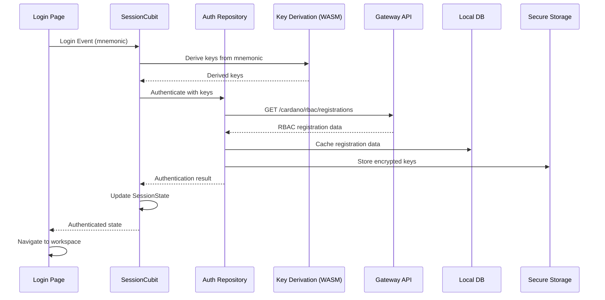
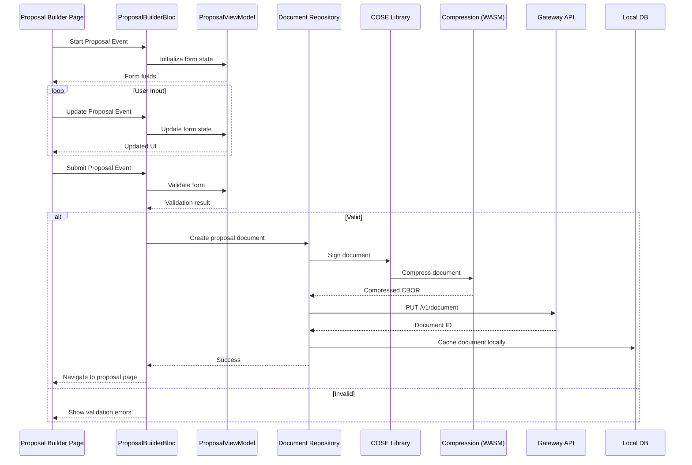
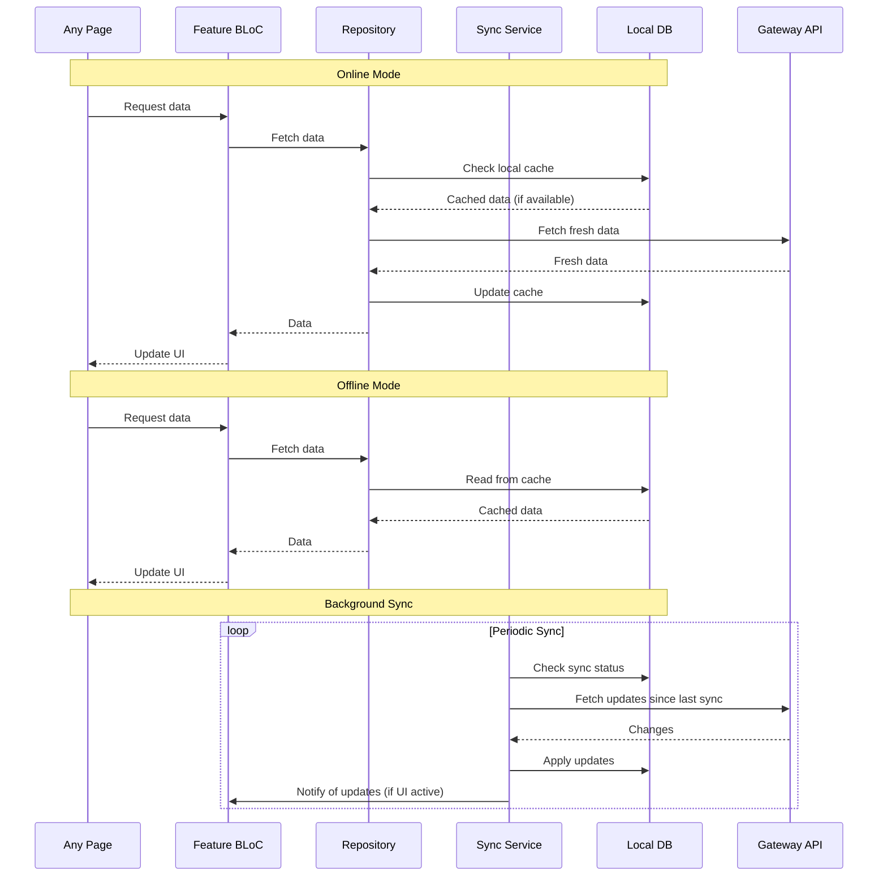

# Runtime View

<!-- See: https://docs.arc42.org/section-6/ -->

## Runtime Scenario 1: Chain Synchronization

**Scenario**: Application needs to synchronize with Cardano blockchain from genesis or tip.

**Runtime Flow**:

1. **Application Initialization**
   - Application creates a `ChainFollower` instance
   - Configures network (mainnet, preprod, preview)
   - Optionally configures Mithril snapshot

2. **Connection Establishment**
   - Follower establishes Node-to-Node connection to Cardano node
   - Or opens Mithril snapshot for reading
   - Background task starts receiving chain updates

3. **Chain Updates**
   - Background task receives chain updates via async channel
   - Updates can be:
     - Roll forward: New block added
     - Rollback: Chain reorganization
     - Error: Network or node issues

4. **Application Processing**
   - Application receives updates from channel
   - Processes blocks/transactions as needed
   - Handles rollbacks appropriately

5. **Block Reading (Optional)**
   - Application can read specific blocks or ranges
   - Follower creates new connection for block reading
   - Uses Mithril snapshot if available, falls back to node

**Notable Aspects**:
- Async channel for non-blocking updates
- Background task handles network I/O
- Mithril snapshot provides efficient historical access
- Rollback handling ensures data consistency
- Multiple applications can share same follower instance

**Diagram Reference**: See `08_concepts/cardano_chain_follower/overview.md` for detailed diagrams

## Runtime Scenario 2: Signed Document Creation and Signing

**Scenario**: Application creates a Catalyst signed document and signs it with RBAC key.

**Runtime Flow**:

1. **Document Creation**
   - Application uses document builder API
   - Sets document type, content, metadata
   - Adds collaborators if needed
   - Creates initial version

2. **Document Encoding**
   - Document is encoded to COSE format
   - Metadata is structured according to specification
   - Document ID and version are assigned

3. **Key Derivation**
   - Application derives signing key from RBAC registration
   - Uses Catalyst ID URI to identify key
   - Key derivation follows BIP-32/BIP-44 path

4. **Document Signing**
   - Application signs document with derived key
   - Signature is added to COSE structure
   - Document is finalized

5. **Document Storage**
   - Signed document can be stored locally
   - Or uploaded to IPFS via hermes-ipfs
   - Document reference (ID, version) can be stored separately

**Notable Aspects**:
- Type-safe document building
- COSE encoding ensures integrity
- Key derivation provides secure key management
- Versioning supports document evolution
- IPFS provides decentralized storage option

## Runtime Scenario 3: Vote Transaction Creation

**Scenario**: Application creates a vote transaction for blockchain submission.

**Runtime Flow**:

1. **Vote Data Preparation**
   - Application prepares vote data (proposal IDs, choices)
   - Selects vote transaction format (v1 or v2)
   - Gathers required metadata

2. **Transaction Building**
   - Application uses vote-tx-v1 or vote-tx-v2 crate
   - Builds transaction structure
   - Includes voting power information
   - Adds required metadata

3. **Transaction Encoding**
   - Transaction is encoded to CBOR
   - Validated against format specification
   - Ready for blockchain submission

4. **Transaction Submission**
   - Application submits transaction to Cardano node
   - Or uses wallet integration (CIP-30)
   - Transaction is included in blockchain

**Notable Aspects**:
- Multiple format support (v1, v2)
- Type-safe transaction building
- Validation before submission
- Integration with wallet standards (CIP-30)

## Runtime Scenario 4: RBAC Registration

**Scenario**: Application registers RBAC keys on Cardano blockchain.

**Runtime Flow**:

1. **Key Generation**
   - Application generates initial Role 0 key
   - Derives additional role keys as needed
   - Creates keychain structure

2. **Registration Transaction**
   - Application uses rbac-registration crate
   - Builds registration transaction
   - Includes all role keys and metadata
   - Encodes to Cardano transaction format

3. **Transaction Submission**
   - Transaction is submitted to Cardano blockchain
   - Waits for confirmation
   - Registration is now on-chain

4. **Catalyst ID URI Generation**
   - Application generates Catalyst ID URI
   - URI identifies the registration and specific keys
   - URI can be used for document signing

**Notable Aspects**:
- On-chain registration provides verifiable identity
- Key derivation enables key rotation
- Catalyst ID URI provides unambiguous identification
- Integration with Cardano transaction format

## Runtime Scenario 5: Document Verification

**Scenario**: Application verifies a signed document's authenticity.

**Runtime Flow**:

1. **Document Retrieval**
   - Application retrieves document (from IPFS or local storage)
   - Decodes COSE structure
   - Extracts document content and signatures

2. **Signature Extraction**
   - Extracts signatures from COSE structure
   - Identifies signers via Catalyst ID URI
   - Retrieves public keys from RBAC registration

3. **Key Lookup**
   - Looks up RBAC registration on blockchain
   - Verifies registration is valid
   - Retrieves public key for signing role

4. **Signature Verification**
   - Verifies each signature against document content
   - Checks signature validity
   - Verifies signer has required role

5. **Document Validation**
   - Validates document structure
   - Checks metadata consistency
   - Verifies version chain if applicable

**Notable Aspects**:
- Cryptographic verification ensures authenticity
- On-chain key lookup provides trust
- Role-based verification enforces permissions
- Version chain validation ensures integrity

## Runtime Scenario 6: cat-gateway Integration

**Scenario**: cat-gateway service uses catalyst-libs crates for blockchain synchronization and document processing.

**Runtime Flow**:

1. **Service Initialization**
   - cat-gateway starts and initializes chain follower
   - Connects to Cardano node or Mithril snapshot
   - Sets up database connections (PostgreSQL, ScyllaDB)

2. **Blockchain Synchronization**
   - Uses cardano-chain-follower to receive chain updates
   - Processes blocks for RBAC registrations
   - Indexes relevant transactions

3. **Document Processing**
   - Receives signed documents via API
   - Uses catalyst-signed-doc for verification
   - Stores documents and metadata

4. **RBAC Handling**
   - Uses rbac-registration for key lookup
   - Validates Catalyst ID URIs
   - Enforces role-based permissions

5. **API Responses**
   - Processes queries using indexed data
   - Returns structured responses
   - Handles pagination and filtering

**Notable Aspects**:
- Demonstrates real-world usage of catalyst-libs
- Shows integration patterns
- Illustrates service-level architecture
- Combines multiple crates effectively

## Runtime Scenario 7: User Authentication and Session Management

**Scenario**: User authenticates and establishes a session in the Catalyst Voices frontend application.

**Runtime Flow**:

**Notable Aspects**:
- Keys are derived client-side using WASM for security
- RBAC registration data is cached locally for offline access
- Sensitive keys stored in secure storage (encrypted)
- Session state managed reactively via BLoC

## Runtime Scenario 8: Proposal Creation and Submission

**Scenario**: User creates and submits a proposal in the Catalyst Voices frontend application.

**Runtime Flow**:

**Notable Aspects**:
- Form state managed via ViewModel for separation of concerns
- Document signing and compression happen client-side
- Documents cached locally before submission
- Optimistic updates provide immediate feedback

## Runtime Scenario 9: Offline-First Data Synchronization

**Scenario**: The frontend application handles offline operations and syncs when online.

**Runtime Flow**:

**Notable Aspects**:
- Local database always checked first for responsiveness
- Background sync keeps data fresh when online
- UI updates reactively via BLoC streams
- Conflict resolution handles concurrent modifications
