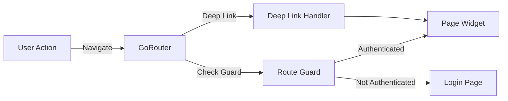

# Frontend Navigation

This section documents navigation patterns and routing concepts used in the Catalyst Voices frontend application.

## Overview

The frontend uses GoRouter for type-safe, declarative routing with support for deep linking, route guards, and state restoration.

## GoRouter Architecture

### Route Definition

Routes are defined declaratively with type safety:
- Path parameters for dynamic routes
- Query parameters for filters/search
- Route guards for authentication

### Deep Linking

Support for:
- Web URLs
- Mobile deep links
- Route restoration

### Navigation Patterns

- Type-safe navigation via generated code
- Route guards for protected routes
- Nested routing for complex flows

## Route Structure

Routes are organized hierarchically:

```dart
GoRoute(
  path: '/',
  redirect: (context, state) => '/workspace',
  routes: [
    GoRoute(
      path: '/workspace',
      builder: (context, state) => WorkspacePage(),
    ),
    GoRoute(
      path: '/proposal/:id',
      builder: (context, state) {
        final id = state.pathParameters['id']!;
        return ProposalPage(proposalId: id);
      },
    ),
  ],
)
```

## Route Guards

Route guards protect routes based on authentication state:

```dart
GoRoute(
  path: '/settings',
  builder: (context, state) => SettingsPage(),
  redirect: (context, state) {
    final sessionCubit = context.read<SessionCubit>();
    if (sessionCubit.state is! SessionAuthenticated) {
      return '/login';
    }
    return null;
  },
)
```

## Deep Linking

Deep links enable:
- Direct navigation to specific content
- Web URL sharing
- Mobile app deep links
- Route restoration after app restart

## Navigation Flow



## Type Safety

GoRouter with code generation provides:
- Compile-time route validation
- Type-safe navigation methods
- Path parameter type checking
- Query parameter validation

## Best Practices

1. **Centralized Route Definitions**: Define all routes in a single location
2. **Route Guards**: Use guards for authentication and authorization
3. **Deep Link Support**: Support deep linking for all major features
4. **State Restoration**: Preserve navigation state across app restarts
5. **Error Handling**: Handle invalid routes gracefully

## Testing

Navigation can be tested:
- Route definition validation
- Guard behavior testing
- Deep link handling tests
- Navigation flow integration tests

See [ADR 0016](../09_architecture_decisions/0016-routing-architecture-gorouter.md) for detailed implementation decisions.
