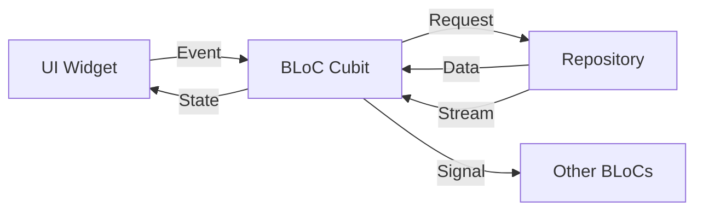

# Frontend State Management

This section documents state management patterns and concepts used in the Catalyst Voices frontend application.

## Overview

The frontend uses a combination of BLoC pattern, ViewModels, and reactive streams for state management. This provides a clear separation of concerns and enables testable, maintainable code.

## BLoC Pattern

### BLoC vs Cubit

- **BLoC**: Use for complex state machines with multiple event types
- **Cubit**: Use for simpler state management with direct method calls

### State Structure

States should be:
- Immutable
- Equatable for efficient rebuilds
- Descriptive of UI state

### Event Structure

Events should:
- Represent user actions or system events
- Be immutable
- Contain minimal data (prefer IDs over full objects)

## ViewModel Pattern

ViewModels transform BLoC state into UI-specific data:
- Format data for display
- Handle UI-specific logic
- Abstract presentation concerns from BLoCs

## Signal Pattern

Signals enable cross-BLoC communication:
- Emit signals from one BLoC
- Listen to signals in other BLoCs
- Use for decoupled feature communication

## Repository Pattern

Repositories abstract data sources:
- Single source of truth for data
- Abstract API and local storage
- Enable offline-first architecture

## Architecture Layers

The state management architecture follows Clean Architecture principles:

1. **Presentation Layer**: UI widgets that consume BLoC states
2. **Business Logic Layer**: BLoCs/Cubits that manage state and handle events
3. **Domain Layer**: Repositories that abstract data access
4. **Data Layer**: API clients, local database, and external services

## State Flow

## Best Practices

1. **One BLoC per Feature**: Each feature domain should have its own BLoC
2. **Repository Abstraction**: BLoCs should only interact with repositories, never directly with APIs
3. **Error Handling**: Use error states to communicate failures to UI
4. **Loading States**: Provide loading states for async operations
5. **State Immutability**: All states should be immutable
6. **Equatable**: Use Equatable for efficient state comparisons

## Testing

BLoCs are highly testable:
- Unit tests for state transitions
- Event handling tests
- Repository mocking for isolated testing
- Widget tests for UI integration

See [ADR 0017](../09_architecture_decisions/0017-state-management-bloc-pattern.md) for detailed implementation decisions.
