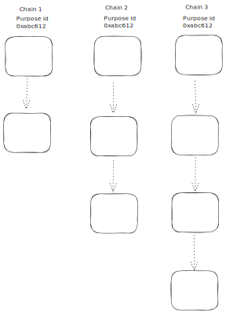
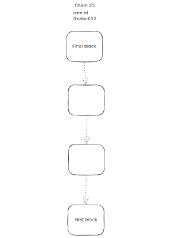

# Immutable Ledger Design

---

Title: Immutable Ledger Design

Status: Proposed

Authors:
    - Alex Pozhylenkov <alex.pozhylenkov@iohk.io>

Created: 2024-08-19

---

## Abstract

This document describes a specification of the immutable ledger for various purposes of project "Catalyst".

## Motivation

Project "Catalyst" requires a solution for storing people votes and any other data,
in a transparent, verifiable, scalable and immutable way.

## Specification

### Ledger structure

{ align=right }

Ledger will be represented as a collection of distinct, unconnected chains,
processed and run in parallel.
The only common thing for all these chains will be a "tree" identifier,
so these chains will serve and form an overall ledger state.

Obviously, given approach leads to data duplication,
as each chain, will not know anything about others.
And it also requires that the overall ledger state,
could be deterministically defined at any point of time,
considering potential transaction overlapping or duplication.

To achieve an immutability of data inside each chain
Each particular chain, will be a common sequence of blocks.
To achieve an immutability of data inside each chain,
cryptographic hashing is applied.
So each block from the chain reference to the hash of previous one.
It is a widely used technic to prevent a modification of some data from previous blocks,
without affecting structure of the current one.

The described approach allows to easily scale and increase throughput of the network on demand at any time,
just by starting to process new chains.
<!-- markdownlint-disable no-inline-html -->
<br clear="right"/>
<!-- markdownlint-enable no-inline-html -->

### Temporary chains

{ align=right }

It's a common thing for blockchains to have a starting block (genesis),
but it's unusual to have a final block for a chain.
After which no any block could be produced.

And that's a main distinguish for this Immutable Ledger design,
it has a final block.

So any chain will be bounded by some period of time.
Which is well suited where it comes to process some temporary event e.g. voting.
<!-- markdownlint-disable no-inline-html -->
<br clear="right"/>
<!-- markdownlint-enable no-inline-html -->

### Block structure

Immutable ledger block is a [Catalyst Signed Document],
so its fully follows the structure of the [Catalyst Signed Document] specification.

### Metadata Fields

* [`id`](./../signed_doc/metadata.md#id).
  Used as a unique identifier of the chain.
  So all blocks from the same chain must have the same
  [`id`](./../signed_doc/metadata.md#id) field value.
* [`ver`](./../signed_doc/metadata.md#ver).
  Used as a unique identifier of the block itself.
  Also the block's creation `timestamp` value is determined from the
  [`ver`](./../signed_doc/metadata.md#ver) field.
* [`content type`](./../signed_doc/spec.md#content-type): `application/cbor`.
  [Catalyst Signed Document content] must be a [CBOR] encoded.

  ```CDDL
  3 => 50
  ```

* [`content encoding`](./../signed_doc/spec.md#content-encoding):
  [Catalyst Signed Document content] must be [Brotli] compressed.

  ```CDDL
  "content-type" => "br"
  ```

* [`type`](./../signed_doc/metadata.md#type): `d9e7e6ce-2401-4d7d-9492-f4f7c64241c3` [UUID] value.

  ```CDDL
  "type" => 37(h'D9E7E6CE24014D7D9492F4F7C64241C3')
  ```

* [`ref`](./../signed_doc/metadata.md#ref).
  Previous block reference, including Hash of the previous block.

### Content format

<!-- markdownlint-disable max-one-sentence-per-line code-block-style -->
??? note "Block CDDL definition: `block.cddl`"

    ```CDDL
    {{ include_file('src/architecture/08_concepts/immutable_ledger/cddl/block.cddl', indent=4) }}
    ```
<!-- markdownlint-enable max-one-sentence-per-line code-block-style -->

Header:

* `height` - block's height.
  Also is used to identify the block type: *genesis*, *regular*, *final*
  (in more details described in [validation section](#block-validation-rules)).
* `ledger-type` - unique identifier of the ledger type.
  In general, this is the way to strictly bound and specify `block-data` of the ledger for the specific `ledger-type`.
  But such rules will be a part of the specific ledger type definition,
  and not specified by this document.
* `purpose-id` - unique identifier of the purpose.
  As it was stated before,
  each Ledger instance will have a strict time boundaries,
  so each of them will run for different purposes.
  This is the way to distinguish them.
* `extra-header-data` - fully optional field, to add some arbitrary data to the block header.

Block:

* `block-header` - block header described above,
* `block-data` - an array of some CBOR encoded data

### Block validation rules

* [`id`](./../signed_doc/metadata.md#id)
  **MUST** be the same as for the previous block (except for genesis).
* `height` **MUST** be incremented by `1` from the previous block height value (except for genesis and final block).
  *Genesis* block **MUST** have `0` value.
  *Final* block **MUST** hash be incremented by `1` from the previous block height and changed the sign to negative.
  E.g. previous block height is `9` and the *Final* block height is `-10`.
* *Final* block is the last one for the specific chain and any other block could not be referenced to the *Final* one.

* [`ver`](./../signed_doc/metadata.md#ver)
  timestamp value **MUST** be greater or equals than the corresponding `timestamp`
  of the previous block (except for genesis).
* [`ref`](./../signed_doc/metadata.md#ref)
  **MUST** be a reference to the previous block (except for genesis).
* `ledger-type` **MUST** be the same as for the previous block if present (except for genesis).
  **MANDATORY** field for *Genesis* and *Final* blocks.
* `purpose-id` **MUST** be the same as for the previous block if present (except for genesis).
  **MANDATORY** field for *Genesis* and *Final* blocks.
* [`kid`](./../signed_doc/spec.md#kid) field
  **MUST** be the same as for the previous block (except for genesis).

## Rationale

## Path to Active

### Acceptance Criteria
<!-- Describes what are the acceptance criteria whereby a proposal becomes 'Active' -->

### Implementation Plan
<!-- A plan to meet those criteria or `N/A` if an implementation plan is not applicable. -->

<!-- OPTIONAL SECTIONS: see CIP-0001 > Document > Structure table -->

[Catalyst Signed Document]: ./../signed_doc/spec.md
[Catalyst Signed Document content]: ./../signed_doc/spec.md#content-type
[Brotli]: https://datatracker.ietf.org/doc/html/rfc7932
[CBOR]: https://datatracker.ietf.org/doc/rfc8949/
