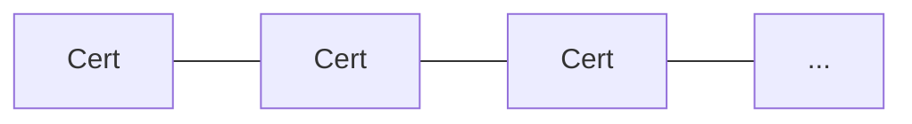
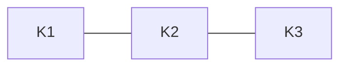
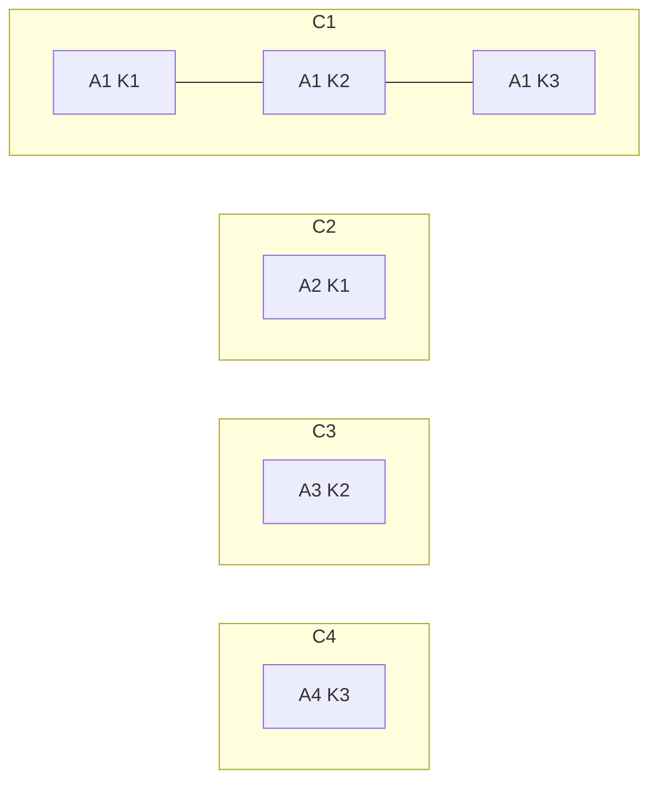
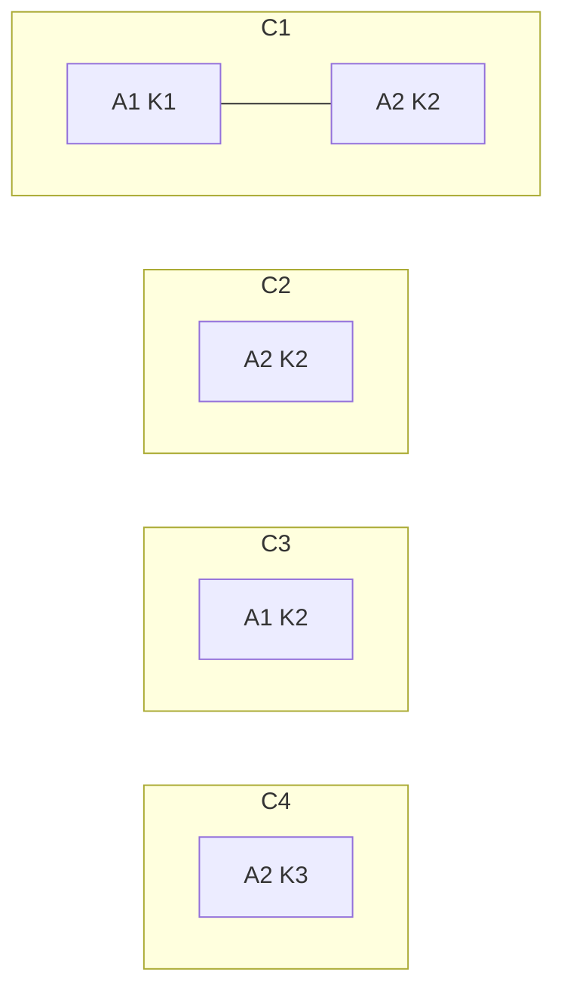

# Examples

## Preface

The goal of this document is to describe how multiple RBAC registrations apply on top of each other with emphasis on
non-obvious cases.
For more general information about RBAC registration and Cip509 see the links in the [readme].

[readme]: https://github.com/input-output-hk/catalyst-libs/blob/main/rust/rbac-registration/README.md

## Glossary

Commonly used abbreviations in this document:

* A stake address, `A1`, `A2`, etc. - a stake address in the role 0 registration.
* A key, `K1`, `K2`, etc. - a subject public key of the role 0.
* Chain, `C1`, `C2`, etc. - a chain of individual registration transactions.

## Examples

### Useless updates

It is allowed to update the role 0 with the exact same certificate.
While it is completely useless, one can simply change the key every time with the same effect, so it doesn't make sense
to prevent it.

### Updating a stake address

It is allowed to change a stake address by updating the role 0.

### Updating a public key

It is allowed to change a public key by updating the role 0.
It is worth noting that the Catalyst ID associated with this registration chain is based on the subject public key of
the very first role 0 registration and updating the key doesn't change the Catalyst ID.
In the example above the Catalyst ID is based on the `K1`.

### Reusing a public key

It isn't allowed to use the key that was already used to start any of existing chains because it would result in the
same Catalyst ID.
In the example above the `C1` chain consists of the initial registration with the `K1` key (therefore the Catalyst ID is
based on it) and two updated with `K2` and `K3`.
The `C2` chain is invalid because it uses the same `K1` and would have the same Catalyst ID.
Both `C3` and `C4` chains are valid even though they use the `K2` and `K3` keys that are already used in the `C1` chain.

### Restarting a chain

In the example above there is the `C1` registration chain that was created with some `A1` stake address and `K1` key
then both address and key were updated to `A2` and `K2`.
The `C2` registration is invalid because it uses the same stake address and key.
There are no reason to start a new registration chain and not to update the existing one, so this isn't allowed.

The `C3` registration is valid because the `K2` key wasn't used before to start a chain and the `A1` stake address isn't
currently used by `C1`.
Warning: this scenario is currently problematic because we never remove entries from the `catalyst_id_for_stake_address`
table.
Therefore, when registration information is requested using the `A1` address we need to build both chains to determine
that only `C3` is relevant.

The `C4` registration is valid, but it "overrides" `C1` essentially discarding it and starting a new chain.
This can be useful if a user lost his private key while maintaining access to his Cardano wallet (and the stake address
used in that registration chain).
After that `C1` is considered no longer valid and must not be used.

### TODO:

* Multiple stake addresses.
* ???
