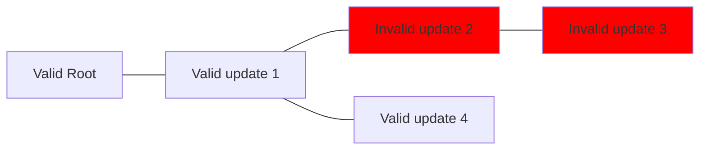
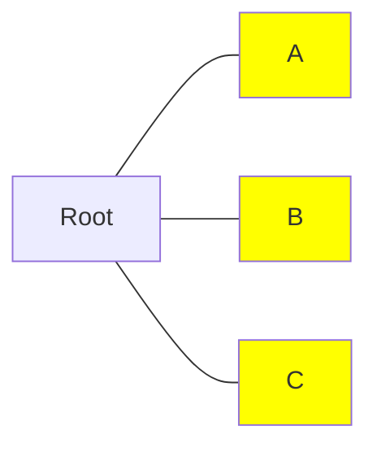
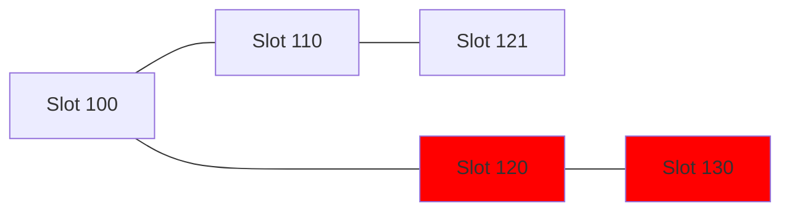
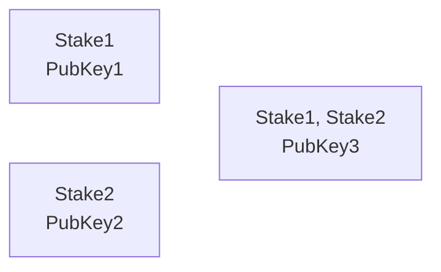
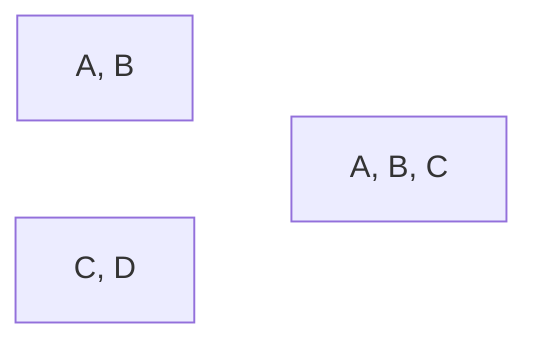

# Examples

## Preface

The goal of this document is to describe how multiple RBAC registrations apply on top of each other with emphasis on
non-obvious cases.
For more general information about RBAC registration and Cip509 see the links in the [readme].

[readme]: https://github.com/input-output-hk/catalyst-libs/blob/main/rust/rbac-registration/README.md

## Glossary

Commonly used abbreviations in this document:

* A stake address or `StakeN` (for example, `Stake1`) - a stake address in the role 0 registration.
* A (public) key or `PubKeyN` (`PubKey3`) - a subject public key of the role 0.
* A chain or `ChainN` (`Chain1`) - a chain of individual registration transactions.
* A root (`Root`) - the first registration in RBAC registration chain.
* A registration or a registration transaction - a transaction that contains CIP509 RBAC registration.

In diagrams registration chains are either marked as `Root --- R1 --- R2 --- ...` when there is a single chain or with
a letter with a number (`A0 --- A1`) when there are multiple ones.

## Examples

### Useless updates

It is allowed to update the role 0 with the exact same certificate.
While it is completely useless, one can simply change the key every time with the same effect, so it doesn't make sense
to prevent it.

### Invalid registrations

All following registrations (either a role update or an additional role) must reference the previous valid registration.
In the example above both the root and the first update are valid.
The second update is invalid, so it is ignored and the chain still consists of two transactions.
The third update can be valid by itself, but as it references the previous invalid update it will be discarded too.
The fourth update references the last valid registration (update number 1), so assuming it is valid, the chain now
consists of three registrations (root, update 1 and update 4).

If the root registration is invalid, then it cannot be continued: any registrations that try to reference it as a
previous one will be invalid.

### Multiple registrations in one block

Technically it is possible for multiple RBAC registration transactions to be included into the same block, but there is
no way to specify the ordering.
Therefore, one should normally wait for the previous transaction to be processed before submitting the next one.

In the example above there are three transactions: `A`, `B` and `C`.
If all of them reference the root registration and are included into the same block then only one of them will be
applied to the registration chain and the other two will be considered invalid.
If these transactions reference each other (`A - B - C`) then only the first one will be applied regardless of the
processing order.

### Branching registrations

It isn't allowed to reference not the latest registration in the chain.
In the example the registration in the slot number 120 would be ignored because it references the root registration, but
the latest transaction is the one in the slot number 110.
The registration in the slot number 130 is ignored because it references an invalid transaction.

### Updating a stake address

It is allowed to change a stake address by updating the role 0.

### Updating a subject public key

It is allowed to change a subject public key by updating the role 0.
It is worth noting that the Catalyst ID associated with this registration chain is based on the subject public key of
the very first role 0 registration and updating the key doesn't change the Catalyst ID.
In the example above the Catalyst ID is based on the `PubKey1`.

### Reusing a public key

It isn't allowed to use the key that was already used to start any of existing chains because it would result in the
same Catalyst ID.
In the example above the `Chain1` chain consists of the initial registration with the `PubKey1` key (therefore the
Catalyst ID is based on it) with two subject public key updates (`PubKey2` and `PubKey3`).
The `Chain2` chain is invalid because it uses the same `PubKey1` and would have the same Catalyst ID.
Both `Chain3` and `Chain4` chains are valid even though they use the `PubKey2` and `PubKey3` keys that are already used
in the `Chain1` chain.

It is worth noting that while it is allowed to reuse a public key there is no practical reason to do so.
The existing chain can be updated instead.

### Restarting a chain {#restarting-chain}

In the example above there is the `Chain1` registration chain that was created with some `Stake1` stake address and
`PubKey1` key then both address and key were updated to `Stake2` and `PubKey2`.
The `Chain2` registration is invalid because it uses the same stake address and key.
There are no reason to start a new registration chain with the same data already registered and not to update the
existing one, so this isn't allowed.

The `Chain3` registration is valid because the `PubKey2` key wasn't used before to start a chain and the `Stake1` stake
address isn't currently used by `Chain1`.
Warning: this scenario is currently problematic because we never remove entries from the `catalyst_id_for_stake_address`
table.
Therefore, when registration information is requested using the `Stake1` address we need to build both chains to
determine that only `Chain3` is relevant.

The `Chain4` registration is valid, but it "overrides" `Chain1` essentially discarding it and starting a new chain
because it has the same stake address (`Stake2`).
This can be useful if a user lost his private key while maintaining access to his Cardano wallet (and the stake address
used in that registration chain).
After that `Chain1` is considered no longer valid and must not be used.

### Restarting multiple chains

It is possible to restart/override multiple chains with one new registration.
In the example above there are two chains with stake addresses `Stake1` and `Stake2` correspondingly.
The new root registration contains both of these addresses, so assuming it is valid, it replaces both two previous
registrations.

As explained in the [restarting a chain](#restarting-chain) example, a new registration must use a different public key,
so using both `PubKey1` and `PubKey2` isn't allowed.

### Restarting chain(s) with multiple stake addresses

It isn't required for a new chain to use all stake addresses of a previous one.
In the example above the new registration used on three addresses of four used in two previous chains.

### Multiple stake addresses

Multiple stake addresses support will be addressed in a future revision.
Currently we only support a single stake address per registration chain.
